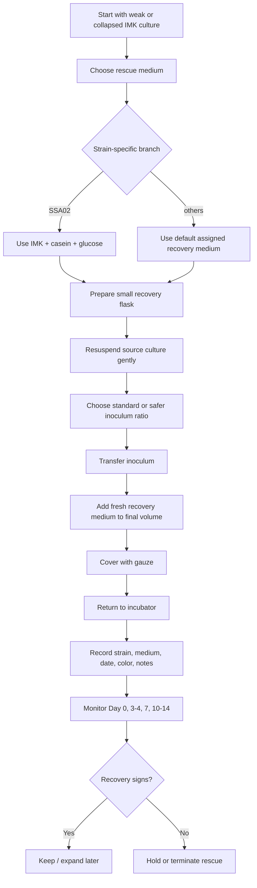

# Dino Daigo's IMK Recovery Plan

## Goal
Attempt small-volume recovery of collapsed or weak **Daigo's IMK** cultures while preserving effort and medium, and prioritize strains that are most likely to benefit from an IMK-based rescue.

## References
- [[xiang2013]]
- [[TingTing's Culturing Symbiodinium Protocol]]
- [[5075ELVC Manual]]

## Main strategy
- For **Daigo's IMK recovery cultures** only
- Use **small-volume rescue**, not scale-up
- Keep this as a **secondary rescue branch**
- Use **strain-specific recovery conditions**
- Only invest further in lines that show signs of recovery

## Current starting point
- Daigo recovery cultures appear **collapsed by eye**
- no obvious color
- no obvious aggregates
- rescue should begin at **small volume**
- vessel for recovery: **`= this.scale_vessel`**
- closure: **gauze**
- cultures kept **static**
- incubator: **26°C**, **12:12**

## Recovery logic
- **SSA02** is the main candidate for special rescue in **IMK + casein + glucose**
- **SSE01** should remain in **IMK only**
- **SSB01** and the remaining strains can start in **plain IMK**
- do not invest in large-volume IMK cultures before signs of recovery appear

## Dynamic recovery summary

```dataviewjs
const p = dv.current();

const finalVol = p.final_volume_ml ?? 100;
const stdRatio = p.standard_inoculum_ratio ?? 0.10;
const safeRatio = p.safer_inoculum_ratio ?? 0.20;
const vessel = p.scale_vessel ?? "250 mL Erlenmeyer";
const strainModes = p.strain_mode ?? {};
const recoveryModes = p.recovery_mode ?? {};

const stdInoc = Math.round(finalVol * stdRatio);
const safeInoc = Math.round(finalVol * safeRatio);
const stdFresh = finalVol - stdInoc;
const safeFresh = finalVol - safeInoc;

dv.header(2, "Recommended recovery target");
dv.paragraph(`Start each IMK rescue line at **${finalVol} mL final volume** in a **${vessel}**.`);

dv.header(2, "Recovery inoculum options");

dv.paragraph(`### Standard recovery option
- inoculum ratio = **${(stdRatio * 100).toFixed(0)}%**
- transfer **${stdInoc} mL** from the collapsed / weak IMK culture
- add **${stdFresh} mL** fresh recovery medium
- final volume = **${finalVol} mL**
`);

dv.paragraph(`### Safer recovery option
- inoculum ratio = **${(safeRatio * 100).toFixed(0)}%**
- transfer **${safeInoc} mL** from the collapsed / weak IMK culture
- add **${safeFresh} mL** fresh recovery medium
- final volume = **${finalVol} mL**
`);

dv.header(2, "Per-strain recovery plan");

const rows = [];
for (const [strain, mode] of Object.entries(strainModes)) {
  const ratio = mode === "safer" ? safeRatio : stdRatio;
  const inoc = Math.round(finalVol * ratio);
  const fresh = finalVol - inoc;
  const medium = recoveryModes[strain] ?? "IMK";
  rows.push([
    strain,
    medium,
    `${(ratio * 100).toFixed(0)}%`,
    `${inoc} mL`,
    `${fresh} mL`,
    `${finalVol} mL`
  ]);
}

dv.table(
  ["Strain", "Recovery medium", "Inoculum ratio", "Inoculum", "Fresh medium", "Final volume"],
  rows
);
```

## Recovery media

### Plain IMK
Use fresh **Daigo's IMK** as the default recovery medium for:
- SSA01
- SSA03
- SSB01
- SSE01

### IMK + casein hydrolysate
Use as an optional rescue condition when a casein branch is wanted.

Using [[TingTing's Culturing Symbiodinium Protocol]]

1. Dissolve **0.4 g casein hydrolysate** into **90 mL ASW**, transfer to a clean **250 mL PYREX Glass Erlenmeyer Flask**, and cover with **aluminum foil**.
2. Autoclave at **121 ºC for 30 minutes**.
3. Let it cool to room temperature.
4. Bring the flask and **10× Daigo's IMK Medium stock solution** to the sterile hood.
5. Add **10 mL 10× Daigo's IMK stock**; this makes **100 mL IMK+cas medium**.

### IMK + glucose
Use as an optional rescue condition when a glucose branch is wanted.

Using [[TingTing's Culturing Symbiodinium Protocol]]

1. Dissolve **0.5 g glucose** into **90 mL ASW**, and cover with **aluminum foil**.
2. Autoclave at **121 ºC for 30 minutes**.
3. Let it cool to room temperature.
4. Bring the flask and **10× Daigo's IMK Medium stock solution** to the sterile hood.
5. Add **10 mL 10× Daigo's IMK stock**; this makes **100 mL IMK+glc medium**.

### IMK + casein + glucose
Use this as a targeted rescue condition for:
- SSA02

**Working inferred recipe** based on the separate IMK+cas and IMK+glc recipes:
1. Dissolve **0.4 g casein hydrolysate** and **0.5 g glucose** into **90 mL ASW**, transfer to a clean **250 mL PYREX Glass Erlenmeyer Flask**, and cover with **aluminum foil**.
2. Autoclave at **121 ºC for 30 minutes**.
3. Let it cool to room temperature.
4. Bring the flask and **10× Daigo's IMK Medium stock solution** to the sterile hood.
5. Add **10 mL 10× Daigo's IMK stock**; this makes **100 mL IMK+cas+glc medium**.

## Dynamic recovery medium preparation summary

```dataviewjs
const p = dv.current();

const finalVol = p.final_volume_ml ?? 100;
const recoveryModes = p.recovery_mode ?? {};

const factor = finalVol / 100;

const recipeMap = {
  "IMK":        {asw: 90 * factor, daigo10x: 10 * factor, casein_g: 0,            glucose_g: 0},
  "IMK+cas":    {asw: 90 * factor, daigo10x: 10 * factor, casein_g: 0.4 * factor,  glucose_g: 0},
  "IMK+glc":    {asw: 90 * factor, daigo10x: 10 * factor, casein_g: 0,            glucose_g: 0.5 * factor},
  "IMK+cas+glc":{asw: 90 * factor, daigo10x: 10 * factor, casein_g: 0.4 * factor,  glucose_g: 0.5 * factor}
};

dv.header(2, "Per-strain medium recipe");

const rows = [];
let totalASW = 0;
let totalDaigo = 0;
let totalCasein = 0;
let totalGlucose = 0;

for (const [strain, medium] of Object.entries(recoveryModes)) {
  const r = recipeMap[medium] ?? recipeMap["IMK"];
  totalASW += r.asw;
  totalDaigo += r.daigo10x;
  totalCasein += r.casein_g;
  totalGlucose += r.glucose_g;

  rows.push([
    strain,
    medium,
    `${r.asw.toFixed(1)} mL`,
    `${r.daigo10x.toFixed(1)} mL`,
    `${r.casein_g.toFixed(2)} g`,
    `${r.glucose_g.toFixed(2)} g`
  ]);
}

dv.table(
  ["Strain", "Recovery medium", "ASW", "Daigo 10×", "Casein hydrolysate", "Glucose"],
  rows
);

dv.header(2, "Total reagents needed");

dv.table(
  ["Reagent", "Total needed"],
  [
    ["ASW (10% safety)", `${(totalASW * 1.1).toFixed(1)} mL`],
    ["Daigo 10× stock", `${totalDaigo.toFixed(1)} mL`],
    ["Casein hydrolysate", `${totalCasein.toFixed(2)} g`],
    ["Glucose", `${totalGlucose.toFixed(2)} g`]
  ]
);
```

## Transfer setup
Perform all rescue transfers inside the **Lab Companion BC-11B** using a **no-flame sterile workflow**.

## Materials
### For IMK recovery transfer
- collapsed / weak Daigo cultures
- fresh sterile **Daigo's IMK**
- fresh sterile **IMK + casein** if needed
- fresh sterile **IMK + glucose** if needed
- fresh sterile **IMK + casein + glucose** if used for SSA02
- pre-labeled **`= this.scale_vessel`**
- gauze
- sterile serological pipettes
- pipette gun
- marker / labels
- notebook / spreadsheet for records

## Recovery steps

```dataviewjs
const p = dv.current();
const finalVol = p.final_volume_ml ?? 100;

let steps = [
  "Prepare fresh recovery media in advance according to the planned recovery mode for each strain.",
  "Pre-label all rescue flasks with strain, medium, date, and recovery condition.",
  "Bring all materials into the **BC-11B** before starting.",
  "Gently resuspend the weak IMK culture and inspect visually for any remaining intact cells or particles.",
  "Transfer the chosen inoculum volume into the new recovery flask.",
  `Add fresh recovery medium until the final volume reaches **${finalVol} mL**.`,
  "Cover the flask with **gauze**.",
  "Swirl gently to mix.",
  "Return the recovery flask to the incubator.",
  "Record strain, medium, inoculum volume, final volume, color, and notes."
];

dv.list(steps);
```

## Monitoring
Check:
- **Day 0**
- **Day 3–4**
- **Day 7**
- **Day 10–14**

Track:
- return of color
- return of visible aggregates / suspended biomass
- OD if measurable
- microscopy if possible
- obvious contamination signs

## Decision rule
Continue an IMK recovery line only if at least one of the following appears:
- visible return of pigmentation
- clear increase in suspended biomass
- intact cells by microscopy
- OD increase relative to the starting rescue point

If none of these appear, keep the line low-priority or terminate the rescue branch.

## Mermaid workflow

