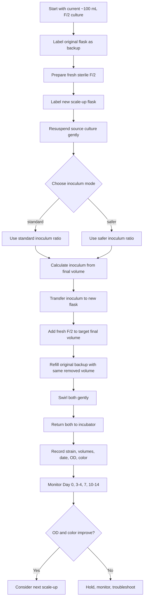

# Dino F/2 Scale-Up Protocol

## Goal
Scale all five F/2 dinoflagellate cultures from ~100 mL into larger fresh-medium volumes while preserving a backup line for each strain.

## References
- [[xiang2013]]
- [[Symbiodiniaceae Culturing Protocols – Parkinson Lab]]

## Main strategy
- For **F/2 media** cultures only
- Use **conservative inoculation**
- Preserve **one backup line per strain**

## Current starting point
- each culture is ~100 mL
- current cultures remain in their existing flasks as backup lines
- vessel for scale-up: **`= this.scale_vessel`**
- closure: **gauze**
- cultures kept **static**
- incubator: **26°C**, **12:12**
- medium for scale-up: **fresh F/2 in ASW**

## Backup strategy
Since there are currently no true backups, the present ~100 mL cultures should be treated as the backup line.

For each strain:
- keep the original ~100 mL culture as a **backup / maintenance line**
- remove only part of it as inoculum for the new scale-up culture
- refill the original culture with the same volume of **fresh F/2** that was removed
- create the new scaled culture in a **separate flask**

## Dynamic protocol summary

```dataviewjs
const p = dv.current();

const finalVol = p.final_volume_ml ?? 250;
const stdRatio = p.standard_inoculum_ratio ?? 0.10;
const safeRatio = p.safer_inoculum_ratio ?? 0.20;
const nStrains = p.n_strains ?? 5;
const vessel = p.scale_vessel ?? "500 mL Erlenmeyer";
const refill = p.backup_refill ?? true;
const strainModes = p.strain_mode ?? {};

const stdInoc = Math.round(finalVol * stdRatio);
const safeInoc = Math.round(finalVol * safeRatio);
const stdFresh = finalVol - stdInoc;
const safeFresh = finalVol - safeInoc;

dv.header(2, "Recommended target");
dv.paragraph(`Scale each strain to **${finalVol} mL final volume** in a new **${vessel}**.`);

dv.header(2, "Conservative inoculum options");

dv.paragraph(`### Standard option - "standard" in this MD
- inoculum ratio = **${(stdRatio * 100).toFixed(0)}%**
- remove **${stdInoc} mL** from the ~100 mL culture
- inoculate into **${stdFresh} mL fresh F/2**
- final volume = **${finalVol} mL**
${refill ? `- refill the original backup culture with **${stdInoc} mL fresh F/2**` : ``}
`);

dv.paragraph(`### Safer option for weaker strains - "safer" in this MD
- inoculum ratio = **${(safeRatio * 100).toFixed(0)}%**
- remove **${safeInoc} mL** from the ~100 mL culture
- inoculate into **${safeFresh} mL fresh F/2**
- final volume = **${finalVol} mL**
${refill ? `- refill the original backup culture with **${safeInoc} mL fresh F/2**` : ``}
`);

dv.header(2, "Per-strain working plan");

const strainRows = [];
for (const [strain, mode] of Object.entries(strainModes)) {
  const ratio = mode === "safer" ? safeRatio : stdRatio;
  const inoc = Math.round(finalVol * ratio);
  const fresh = finalVol - inoc;
  strainRows.push([
    strain,
    mode,
    `${(ratio * 100).toFixed(0)}%`,
    `${inoc} mL`,
    `${fresh} mL`,
    `${finalVol} mL`,
    refill ? `${inoc} mL` : "—"
  ]);
}

dv.table(
  ["Strain", "Mode", "Inoculum ratio", "Inoculum", "Fresh F/2 to new flask", "Final volume", "Backup refill"],
  strainRows
);

dv.header(2, "F/2 preparation summary");

const allStandard = Object.values(strainModes).filter(x => x === "standard").length;
const allSafer = Object.values(strainModes).filter(x => x === "safer").length;
const totalFreshNew = allStandard * stdFresh + allSafer * safeFresh;
const totalFreshRefill = refill ? allStandard * stdInoc + allSafer * safeInoc : 0;
const totalFreshNeeded = totalFreshNew + totalFreshRefill;

dv.table(
  ["Category", "Volume"],
  [
    ["Fresh F/2 for new flasks", `${totalFreshNew} mL`],
    ["Fresh F/2 for backup refills", `${totalFreshRefill} mL`],
    ["Total fresh F/2 needed", `${totalFreshNeeded} mL`],
    ["Suggested prep volume with 10% margin", `${Math.ceil(totalFreshNeeded * 1.1)} mL`]
  ]
);
```

## Transfer setup
Use the **Lab Companion BC-11B**.

## Materials
- Fresh sterile F/2
- labeled vessel for scale-up
- sterile serological pipettes
- pipette gun
- marker / labels
- notebook / spreadsheet for records

## Scale steps

```dataviewjs
const p = dv.current();
const refill = p.backup_refill ?? true;
const finalVol = p.final_volume_ml ?? 250;

let steps = [
  "Prepare fresh sterile F/2.",
  "Pre-label all new scale-up flasks and original backup flasks.",
  "Work inside the **BC-11B**.",
  "Gently resuspend the source culture.",
  "Remove the chosen inoculum volume from the original ~100 mL culture.",
  "Transfer it into the new scale-up flask.",
  `Add fresh F/2 to the new flask to the target final volume (**${finalVol} mL**).`
];

if (refill) {
  steps.push("Refill the original flask with the same volume of fresh F/2 that was removed.");
}

steps = steps.concat([
  "Swirl both flasks gently to mix.",
  "Return both the new scale-up culture and the refilled backup culture to the incubator.",
  "Record all volumes and notes."
]);

dv.list(steps);
```


## Mermaid workflow


