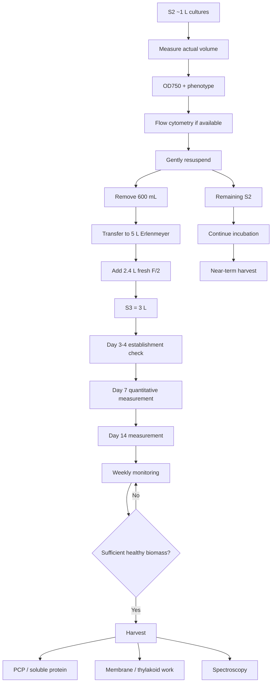

# Dino S3 Biomass Scale-Up Plan

## Goal

Establish the **S3 production generation** of all five F/2 dinoflagellate cultures at:

- **3 L final volume per strain**
- **20% S2 inoculum**
- **5 L Erlenmeyer flask**
- **15 L total S3 culture**

S3 will become the main **large-scale biomass-production line** for future:

- PCP extraction
- pigment/protein spectroscopy
- ammonium sulfate fractionation / salting-out
- SEC purification
- membrane / thylakoid isolation
- acpPC-enriched complex isolation
- structural characterization

The culture lines will now have deliberately different functions:

| Line | Role |
|---|---|
| **M1 / maintenance successor** | Preserve healthy strain lineages |
| **S2** | Current established production culture; source of S3 inoculum and later harvest material |
| **S3** | Large-scale biomass production |

---

# Current culture architecture

```text
M1
│
├── maintenance / lineage preservation
├── microscopy + staining
├── flow-cytometry development
└── F/2 vs IMK biomass pilot


S2 (~1 L)
│
├── 600 mL ───────────────→ S3
│                            │
└── remaining culture       + 2.4 L fresh F/2
       │                     │
       ↓                     ↓
 retain and monitor       S3 = 3 L
       │                     │
       ↓                     ↓
 future harvest          biomass production
                             │
                             ↓
                     biochemical harvest
```

---

# Strains

| Code | Species | S3 target |
|---|---|---:|
| SSA01 | *Symbiodinium linucheae* | 3 L |
| SSA02 | *Symbiodinium necroappetens* | 3 L |
| SSA03 | *Symbiodinium pilosum* | 3 L |
| SSB01 | *Breviolum minutum* | 3 L |
| SSE01 | *Effrenium voratum* | 3 L |

---

# S3 working conditions

| Parameter | Condition |
|---|---|
| Medium | **F/2** |
| Vessel | **5 L Erlenmeyer** |
| Final working volume | **3 L** |
| Approximate headspace | **2 L** |
| Inoculum source | **S2** |
| Inoculum ratio | **20% v/v** |
| Temperature | **26°C** |
| Photoperiod | **16L:8D** |
| Irradiance | **25 µmol photons m⁻² s⁻¹** |
| Agitation | Static |
| Culture purpose | Large-scale biomass production |

## Important

Do **not** deliberately change the light conditions during S3 establishment.

The purpose of this generation is biomass production under the currently stabilized conditions, not another light-acclimation experiment.

---

# S3 calculations

## Per strain

Final S3 volume:

**3,000 mL**

Inoculum ratio:

**20%**

S2 inoculum:

**3,000 mL × 0.20 = 600 mL**

Fresh F/2:

**3,000 mL − 600 mL = 2,400 mL**

### Per-strain recipe

| Component | Volume |
|---|---:|
| S2 inoculum | **600 mL** |
| Fresh sterile 1× F/2 | **2,400 mL** |
| Final S3 volume | **3,000 mL** |

---

# Total requirement for five strains

| Component | Per strain | Five strains |
|---|---:|---:|
| S2 inoculum | 600 mL | **3.0 L** |
| Fresh F/2 | 2.4 L | **12.0 L** |
| Final S3 culture | 3.0 L | **15.0 L** |

---

# F/2 preparation requirement

Exact fresh F/2 required:

**12.0 L**

With 10% preparation margin:

**12.0 L × 1.10 = 13.2 L**

### Prepare

**13.2 L sterile 1× F/2**

See:

- [[ASW recipe]]
- [[F2 Medium Preparation]]
- [[Cleaning Glassware]]
- [[Autoclaving Protocol]]

---

# Dynamic S3 calculator

```dataviewjs
const p = dv.current();

const finalVol = p.s3_final_volume_ml ?? 3000;
const inocRatio = p.s3_inoculum_ratio ?? 0.20;
const n = p.n_strains ?? 5;
const nominalS2 = p.s2_nominal_volume_ml ?? 1000;
const margin = p.f2_safety_factor ?? 0.10;

const inocVol = finalVol * inocRatio;
const freshVol = finalVol - inocVol;

const totalInoc = inocVol * n;
const totalFresh = freshVol * n;
const totalFinal = finalVol * n;
const totalFreshMargin = totalFresh * (1 + margin);

const nominalRemainingS2 = nominalS2 - inocVol;

dv.header(2, "S3 working calculation");

dv.table(
  ["Parameter", "Per strain", `Total (${n} strains)`],
  [
    ["S2 inoculum", `${inocVol.toFixed(0)} mL`, `${(totalInoc / 1000).toFixed(2)} L`],
    ["Fresh F/2", `${freshVol.toFixed(0)} mL`, `${(totalFresh / 1000).toFixed(2)} L`],
    ["Final S3 culture", `${finalVol.toFixed(0)} mL`, `${(totalFinal / 1000).toFixed(2)} L`]
  ]
);

dv.header(2, "Fresh F/2 preparation");

dv.table(
  ["Requirement", "Volume"],
  [
    ["Exact fresh F/2", `${(totalFresh / 1000).toFixed(2)} L`],
    [`Fresh F/2 + ${(margin * 100).toFixed(0)}% margin`, `${(totalFreshMargin / 1000).toFixed(2)} L`]
  ]
);

dv.header(2, "Nominal S2 remainder");

dv.paragraph(`
If each S2 culture actually contains **${nominalS2} mL** before transfer:

- remove **${inocVol.toFixed(0)} mL**
- nominal remaining S2 volume = **${nominalRemainingS2.toFixed(0)} mL**

Because evaporation has occurred previously, measure the actual S2 volume before transfer.
`);
```

---

# Pre-scale S2 assessment

Before transferring any culture, characterize S2.

For **each strain**, record:

- [ ] Actual culture volume
- [ ] OD750
- [ ] Culture color
- [ ] Bottom coverage
- [ ] Attachment
- [ ] Clumping
- [ ] Foggy / extracellular material
- [ ] Photograph
- [ ] Cell count by flow cytometry, if operational
- [ ] Chlorophyll autofluorescence, if operational
- [ ] Microscopy if something appears abnormal

---

# Critical volume check

S2 was established at approximately **1 L**, but the current volume should **not** be assumed to still be exactly 1 L.

Evaporation has affected previous generations.

For each strain:

**Remaining S2 volume = measured S2 volume − 600 mL**

Example:

If measured S2 volume = **930 mL**:

**930 mL − 600 mL = 330 mL remaining**

## Decision rule

If an S2 flask contains **less than 600 mL**, do not automatically sacrifice the entire culture.

Record the actual volume and reassess the inoculum strategy for that strain.

---

# Flow-cytometry integration

S3 is operationally defined using a:

> **20% v/v inoculum**

Once flow-cytometric counting is established, record the S2 cell concentration.

For each strain:

**Transferred cells = S2 cells/mL × 600 mL**

**Starting S3 cells/mL = transferred cells ÷ 3,000 mL**

Because the inoculum is 20% of the final volume:

**Starting S3 cells/mL = S2 cells/mL × 0.20**

This will allow the actual starting biomass of the five S3 cultures to be compared even though their S2 densities differ.

---

# Materials

## Cultures

- SSA01_F2_S2
- SSA02_F2_S2
- SSA03_F2_S2
- SSB01_F2_S2
- SSE01_F2_S2

## Medium

- approximately **13.2 L sterile 1× F/2**

## Vessels

- **5 × 5 L Erlenmeyer flasks**

## Transfer materials

- sterile transfer vessels / serological pipettes suitable for transferring 600 mL inoculum
- sterile serological pipettes
- pipette gun
- sterile F/2
- gauze / established sterile closure
- labels
- marker
- clean working area
- culture record sheet

---

# Flask labels

Label:

```text
SSA01_F2_S3
SSA02_F2_S3
SSA03_F2_S3
SSB01_F2_S3
SSE01_F2_S3
```

Include:

```text
Generation: S3
Date:
Medium: F/2
S2 inoculum: 600 mL
Fresh F/2: 2400 mL
Final volume: 3000 mL
Vessel: 5 L Erlenmeyer
Photoperiod: 16L:8D
Temperature: 26°C
```

---

# S3 transfer procedure

## 1. Prepare medium

Prepare approximately:

**13.2 L sterile 1× F/2**

according to:

[[F2 Medium Preparation]]

Ensure all medium is prepared before manipulating S2.

---

## 2. Prepare S3 vessels

For each strain:

- prepare one sterile **5 L Erlenmeyer**
- label with strain and S3 designation
- confirm flask integrity
- confirm closure / gauze is ready

---

## 3. Inspect S2

Before transfer:

- photograph culture
- record actual volume
- record OD750
- record phenotype

If flow cytometry is available:

- collect a representative sample
- determine cells/mL

---

## 4. Resuspend S2

Gently resuspend the S2 culture.

Because these cultures strongly settle and attach to the bottom, the goal is to obtain the most representative inoculum possible.

Avoid:

- vortexing
- vigorous shaking
- excessive shear

Use gentle swirling until the culture is reasonably homogeneous.

---

## 5. Remove S3 inoculum

Transfer:

> **600 mL S2**

into the corresponding sterile **5 L Erlenmeyer**.

---

## 6. Add fresh F/2

Add:

> **2.4 L fresh sterile 1× F/2**

Final S3 volume:

> **3.0 L**

---

## 7. Mix

Gently swirl the 5 L flask to distribute the inoculum.

Do not vigorously shake.

---

## 8. Close culture

Apply the established sterile gas-exchange closure.

Return the culture to the incubator.

---

## 9. Preserve S2 identity

**Do not refill S2 back to 1 L.**

The remaining S2 is intentionally retained as the older established production generation.

Record:

- measured volume before transfer
- volume removed
- remaining volume
- culture condition after transfer

---

# What happens to S2?

After establishing S3:

```text
S2
│
├── 600 mL → S3
│
└── remaining S2
       │
       ├── continue incubation
       ├── monitor condition
       ├── flow cytometry
       ├── microscopy if useful
       └── future biochemical harvest
```

S2 becomes a logical **near-term harvest candidate**.

Potential uses:

- PCP extraction
- pigment spectroscopy
- soluble-protein extraction
- membrane isolation
- comparison with future S3 biomass

---

# What happens to M1?

M1 should now be treated primarily as the **maintenance and experimental-support branch**, not as another production line.

Current M1 can be used for:

1. establishing a fresh maintenance generation
2. F/2 vs IMK growth comparison
3. microscopy/staining with Huichi
4. flow-cytometry method development
5. preservation experiments
6. plate backup

---

# Maintenance-line transition

Once convenient:

```text
Current M1
│
├── small inoculum → fresh maintenance generation
├── F/2 vs IMK experiment
├── microscopy / staining
├── flow cytometry
└── preservation experiments
```

The fresh maintenance generation should remain deliberately small.

Its purpose is:

> **healthy lineage preservation**

rather than biomass production.

---

# IMK experiment

Use maintenance-line material rather than sacrificing S2/S3 production biomass.

For each strain establish:

```text
same source culture
      │
      ├── F/2 control
      │
      └── IMK
```

Preferably normalize the starting biomass using flow-cytometry cell counts.

If cell counting is not yet operational:

> Starting cell concentration = **N/A**

Use an equivalent documented inoculum strategy instead.

---

# S3 Day 0 record

| Parameter | SSA01 | SSA02 | SSA03 | SSB01 | SSE01 |
|---|---|---|---|---|---|
| S2 actual volume | | | | | |
| S2 OD750 | | | | | |
| S2 cells/mL | | | | | |
| S2 color | | | | | |
| Inoculum volume | 600 mL | 600 mL | 600 mL | 600 mL | 600 mL |
| Fresh F/2 | 2.4 L | 2.4 L | 2.4 L | 2.4 L | 2.4 L |
| S3 final volume | 3 L | 3 L | 3 L | 3 L | 3 L |
| S3 starting cells/mL | | | | | |
| Remaining S2 volume | | | | | |
| Notes | | | | | |

---

# S3 monitoring schedule

## Day 0

Record baseline:

- OD750
- cells/mL if available
- actual volume
- color
- pigmentation
- settling
- attachment
- clumping
- photograph

---

## Day 3–4

Primary objective:

**Confirm successful establishment.**

Check:

- color
- settling
- obvious contamination
- unusual bleaching
- attachment
- clumping

Avoid unnecessary manipulation if cultures appear normal.

---

## Day 7

Measure:

- OD750
- cells/mL
- actual volume
- phenotype
- photograph

---

## Day 14

Repeat quantitative assessment.

At this point begin evaluating the S3 growth trajectory.

---

## After Day 14

Monitor approximately weekly unless culture behavior indicates that a shorter interval is useful.

---

# Routine S3 monitoring table

| Date | Strain | Age | Volume | OD750 | Cells/mL | Total cells | Color | Clumping | Attachment | Notes |
|---|---|---:|---:|---:|---:|---:|---|---|---|---|
| | SSA01 | | | | | | | | | |
| | SSA02 | | | | | | | | | |
| | SSA03 | | | | | | | | | |
| | SSB01 | | | | | | | | | |
| | SSE01 | | | | | | | | | |

---

# Total-cell calculation

Once flow cytometry is validated:

**Total cells = cells/mL × actual culture volume in mL**

Example:

If:

- cell concentration = **2.5 × 10⁵ cells/mL**
- culture volume = **2,900 mL**

then:

**Total cells = 2.5 × 10⁵ × 2,900**

**Total cells = 7.25 × 10⁸ cells**

Total cell number should become an important biomass metric.

OD750 should remain useful as a rapid longitudinal measurement but should not be interpreted independently of:

- culture volume
- cell concentration
- pigmentation
- settling
- clumping
- microscopy

---

# Harvest logic

Do **not** define S3 harvest by culture age alone.

Evaluate harvest based on:

- total cells
- growth trajectory
- pigmentation
- microscopy
- chlorophyll autofluorescence
- recoverable biomass
- culture volume
- evidence of stationary phase / declining growth
- intended downstream experiment

The objective is to harvest:

> **large quantities of physiologically useful biomass**

rather than simply the oldest possible culture.

---

# S3 production workflow



---

# September immediate work plan

## Before the High Holidays

- [ ] Establish flow-cytometry cell counting
- [ ] Perform microscopy/staining with Huichi
- [ ] Measure actual S2 volumes
- [ ] Record S2 OD750
- [ ] Prepare approximately **13.2 L F/2**
- [ ] Prepare / sterilize **5 × 5 L Erlenmeyers**
- [ ] Establish all five **3 L S3 cultures**
- [ ] Preserve remaining S2
- [ ] Establish small F/2 vs IMK biomass test
- [ ] Establish / plan refreshed maintenance cultures
- [ ] Continue Research Proposal writing

## During the High Holidays

Primary culture objective:

> **Leave established cultures growing under stable conditions.**

Avoid unnecessary changes to:

- irradiance
- photoperiod
- temperature
- medium
- vessel position

## After the High Holidays

- [ ] Inspect S3 establishment
- [ ] Measure S2/S3 OD750
- [ ] Measure cells/mL
- [ ] Record actual volumes
- [ ] Evaluate F/2 vs IMK
- [ ] Select S2 material for harvest
- [ ] Begin first biochemical purification workflow from harvested biomass
- [ ] Continue monitoring S3 toward preparative harvest

---

# Key September transition

The culture system is moving from:

```text
keep everything alive
        ↓
grow everything
        ↓
wait
```

to:

```text
MAINTENANCE
healthy lineage preservation

        +

PRODUCTION
S2 → S3 → harvest

        +

CHARACTERIZATION
OD + flow cytometry + microscopy

        +

BIOCHEMISTRY
harvest → extraction → purification → spectroscopy
```

---

# Key S3 definition

> **S3 = five 3-L F/2 production cultures grown in 5-L Erlenmeyer flasks, established using 600 mL (20%) S2 inoculum + 2.4 L fresh F/2 per strain.**

Total S3 production volume:

**15 L**

Fresh F/2 requirement:

**12 L exact**

Fresh F/2 to prepare with 10% margin:

**13.2 L**

Nominal S2 remainder if the culture still contains 1 L:

**400 mL per strain**

The actual S2 remainder must be calculated using the measured pre-transfer culture volume.