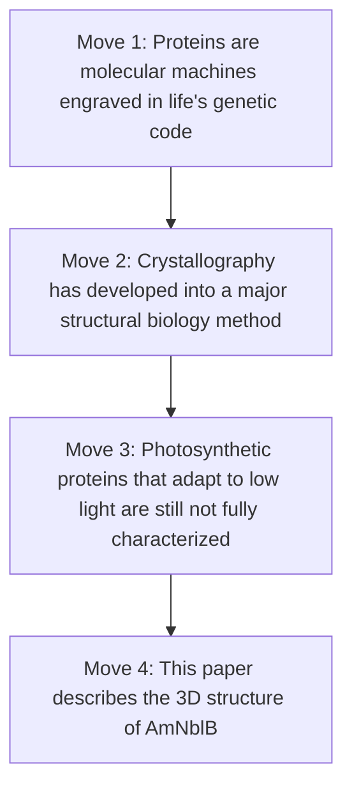

# Structural Characterization of AmNblB from *Acaryochloris marina*

## Stage 1 – Flow chart

---

##  Introduction

## Structural Characterization of AmNblB from *Acaryochloris marina*

 Establishing the field

Proteins are molecular machines engraved in life’s genetic code, molded by environmental pressure and natural selection.  Proteins perform functions based on their building blocks, and, as with other machines, proteins need to have the appropriate parts, proper dimensions, and be built and used in a specific three-dimensional orientation. Because of this, understanding protein structure is important for understanding protein function.

Crystallography is one of the methods used to observe the three-dimensional structure of proteins. In protein crystallography, proteins first need to be purified and ordered into crystals, which are three-dimensional arrays of repeated protein molecules. X-rays are then used to detect how electrons are distributed around the protein, allowing researchers to infer the protein’s three-dimensional structure [1–3].

###  Previous research and current knowledge

X-ray crystallography was first developed in the early twentieth century, especially through the work of William Henry Bragg and William Lawrence Bragg in the 1910s [1]. Later, protein crystallography became possible when researchers such as John Kendrew and Max Perutz solved the first protein structures in the 1950s and 1960s [2,3]. Today, we have online databases where we can browse hundreds of thousands of proteins whose three-dimensional structures have been observed, measured, and categorized [4].

These structures help scientists compare proteins, predict possible functions, and understand how proteins interact with other molecules. This is especially useful in photosynthetic systems, where many proteins work together to capture light and transfer energy.

###  Gap and motivation

However, photosynthetic proteins capable of adapting to low-light conditions are not fully characterized, despite the importance of fully describing these systems for potential future sustainable development technologies. In these systems, specialized proteins, such as lyases and synthases, build and break the light-harvesting machinery. They can tweak the system, prevent it from overloading in high-light conditions, and optimize it when low-light conditions arrive.

*Acaryochloris marina* photosynthetic systems are unique because they are highly optimized for using the small amount of light that reaches certain marine environments. This organism uses an unusual photosynthetic system based on chlorophyll *d*, which allows it to harvest far-red light that is not efficiently used by most photosynthetic organisms [5]. Understanding the three-dimensional structure of the lyases in these systems can help us understand the mechanisms by which *A. marina* adapts to changing light conditions as a marine cyanobacterium.

###  Present paper

The three-dimensional structure of AmNblB, a lyase belonging to this system, is described in this paper. Our results show the AmNblB structure as [insert your actual structural result here], and this may suggest a role when nutrients are not available, disassembling the light-harvesting complex and recycling its components to maintain vital functions.

---

## References

[1] Bragg, W. H., & Bragg, W. L. (1915). *X-rays and Crystal Structure*. London: G. Bell and Sons.

[2] Kendrew, J. C., Dickerson, R. E., Strandberg, B. E., Hart, R. G., Davies, D. R., Phillips, D. C., & Shore, V. C. (1960). Structure of myoglobin: A three-dimensional Fourier synthesis at 2 Å resolution. *Nature, 185*, 422–427. https://doi.org/10.1038/185422a0

[3] Perutz, M. F., Rossmann, M. G., Cullis, A. F., Muirhead, H., Will, G., & North, A. C. T. (1960). Structure of haemoglobin: A three-dimensional Fourier synthesis at 5.5 Å resolution, obtained by X-ray analysis. *Nature, 185*, 416–422. https://doi.org/10.1038/185416a0

[4] Berman, H. M., Westbrook, J., Feng, Z., Gilliland, G., Bhat, T. N., Weissig, H., Shindyalov, I. N., & Bourne, P. E. (2000). The Protein Data Bank. *Nucleic Acids Research, 28*(1), 235–242. https://doi.org/10.1093/nar/28.1.235

[5] Mohr, R., Voss, B., Schliep, M., Kurz, T., Maldener, I., Adams, D. G., Larkum, A. W. D., Chen, M., & Hess, W. R. (2010). A new chlorophyll *d*-containing cyanobacterium: Evidence for niche adaptation in the genus *Acaryochloris*. *The ISME Journal, 4*, 1456–1469. https://doi.org/10.1038/ismej.2010.67