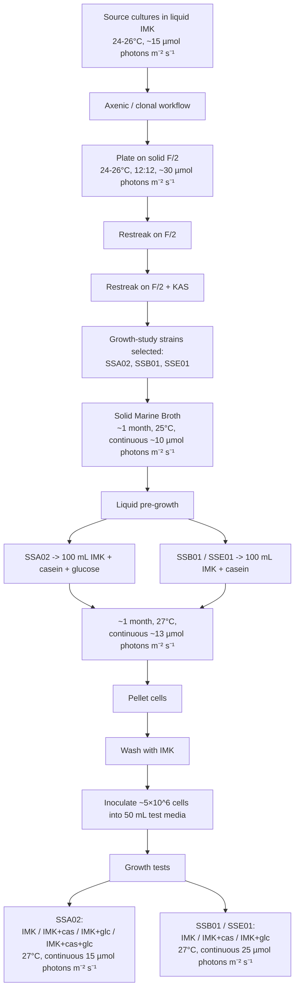

```mermaid
flowchart TD
    A[Source cultures in liquid IMK<br/>24-26°C, ~15 µmol photons m⁻² s⁻¹] --> B[Axenic / clonal workflow]
    B --> C[Plate on solid F/2<br/>24-26°C, 12:12, ~30 µmol photons m⁻² s⁻¹]
    C --> D[Restreak on F/2]
    D --> E[Restreak on F/2 + KAS]

    E --> F[Growth-study strains selected:<br/>SSA02, SSB01, SSE01]
    F --> G[Solid Marine Broth<br/>~1 month, 25°C, continuous ~10 µmol photons m⁻² s⁻¹]

    G --> H[Liquid pre-growth]
    H --> I[SSA02 -> 100 mL IMK + casein + glucose]
    H --> J[SSB01 / SSE01 -> 100 mL IMK + casein]

    I --> K[~1 month, 27°C,<br/>continuous ~13 µmol photons m⁻² s⁻¹]
    J --> K

    K --> L[Pellet cells]
    L --> M[Wash with IMK]
    M --> N[Inoculate ~5×10^6 cells into 50 mL test media]

    N --> O[Growth tests]
    O --> P[SSA02:<br/>IMK / IMK+cas / IMK+glc / IMK+cas+glc<br/>27°C, continuous 15 µmol photons m⁻² s⁻¹]
    O --> Q[SSB01 / SSE01:<br/>IMK / IMK+cas / IMK+glc<br/>27°C, continuous 25 µmol photons m⁻² s⁻¹]
```

